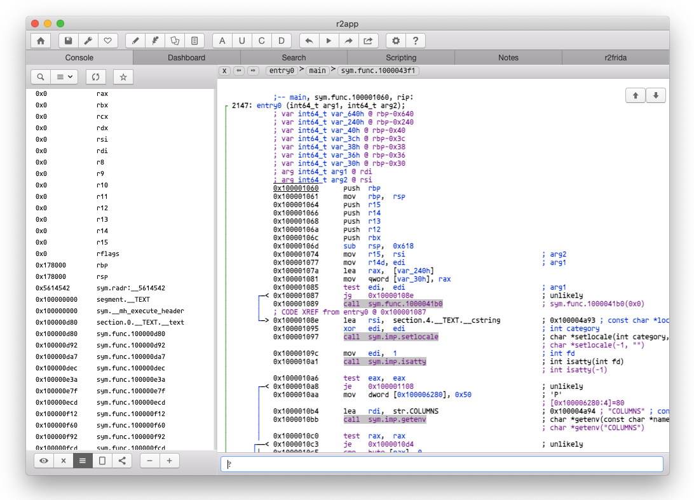

r2app
=====

An electron based app for Desktop using radare2.

Running
--------

You can run it by just typing `make`.

Developers
----------

To debug/develop/inspect the UI edit main.js and set `devConsole = true`

Packaging
---------

The distribution builds are generated with `make linux macos windows`.
